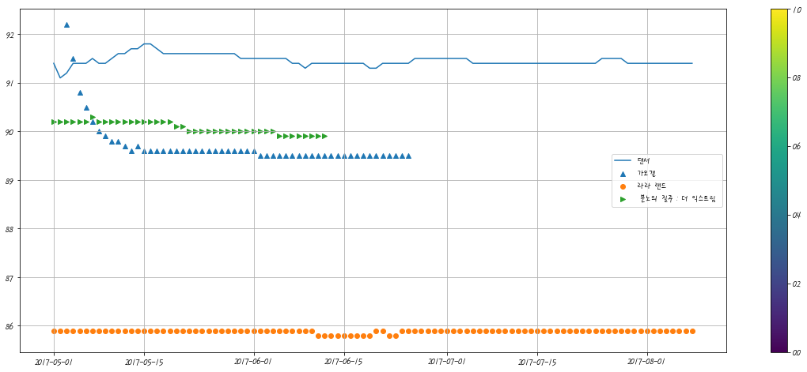
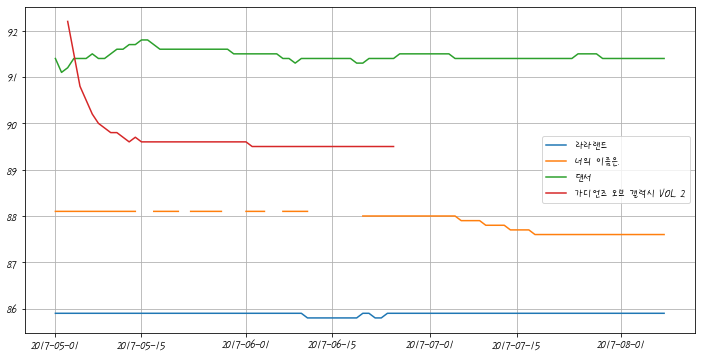

```python
from bs4 import BeautifulSoup
import pandas as pd
import matplotlib.pyplot as plt
from urllib.request import urlopen

# https://movie.naver.com/movie/sdb/rank/rmovie.nhn?sel=cur&tg=0&date=20121114


url_base ="https://movie.naver.com/"
url_syb = "movie/sdb/rank/rmovie.nhn?sel=cur&date=20170804"
page = urlopen(url_base+url_syb)

soup = BeautifulSoup(page, "html.parser")
soup.find_all("div",'tit5')
```


    [<div class="tit5">
     <a href="/movie/bi/mi/basic.nhn?code=62586" title="다크 나이트">다크 나이트</a>
     </div>,
     <div class="tit5">
     <a href="/movie/bi/mi/basic.nhn?code=164290" title="킹 오브 프리즘 프라이드 더 히어로">킹 오브 프리즘 프라이드 더 히어로</a>
     </div>,
     <div class="tit5">
     <a href="/movie/bi/mi/basic.nhn?code=152160" title="킹 오브 프리즘">킹 오브 프리즘</a>
     </div>,
     <div class="tit5">
     <a href="/movie/bi/mi/basic.nhn?code=10448" title="오즈의 마법사">오즈의 마법사</a>
     </div>,
     <div class="tit5">
     <a href="/movie/bi/mi/basic.nhn?code=154437" title="내 사랑">내 사랑</a>
     </div>,
     <div class="tit5">
     <a href="/movie/bi/mi/basic.nhn?code=160135" title="서서평, 천천히 평온하게">서서평, 천천히 평온하게</a>
     </div>,
     <div class="tit5">
     <a href="/movie/bi/mi/basic.nhn?code=10217" title="로보캅">로보캅</a>
     </div>,
     <div class="tit5">
     <a href="/movie/bi/mi/basic.nhn?code=76309" title="플립">플립</a>
     </div>,
     <div class="tit5">
     <a href="/movie/bi/mi/basic.nhn?code=159054" title="명탐정 코난:진홍의 연가">명탐정 코난:진홍의 연가</a>
     </div>,
     <div class="tit5">
     <a href="/movie/bi/mi/basic.nhn?code=31827" title="헤드윅">헤드윅</a>
     </div>,
     <div class="tit5">
     <a href="/movie/bi/mi/basic.nhn?code=153621" title="댄서">댄서</a>
     </div>,
     <div class="tit5">
     <a href="/movie/bi/mi/basic.nhn?code=38444" title="이터널 선샤인">이터널 선샤인</a>
     </div>,
     <div class="tit5">
     <a href="/movie/bi/mi/basic.nhn?code=17970" title="샤인">샤인</a>
     </div>,
     <div class="tit5">
     <a href="/movie/bi/mi/basic.nhn?code=36944" title="올드보이">올드보이</a>
     </div>,
     <div class="tit5">
     <a href="/movie/bi/mi/basic.nhn?code=95767" title="어네스트와 셀레스틴">어네스트와 셀레스틴</a>
     </div>,
     <div class="tit5">
     <a href="/movie/bi/mi/basic.nhn?code=27350" title="기쿠지로의 여름">기쿠지로의 여름</a>
     </div>,
     <div class="tit5">
     <a href="/movie/bi/mi/basic.nhn?code=125417" title="파도가 지나간 자리">파도가 지나간 자리</a>
     </div>,
     <div class="tit5">
     <a href="/movie/bi/mi/basic.nhn?code=146469" title="택시운전사">택시운전사</a>
     </div>,
     <div class="tit5">
     <a href="/movie/bi/mi/basic.nhn?code=134772" title="눈길">눈길</a>
     </div>,
     <div class="tit5">
     <a href="/movie/bi/mi/basic.nhn?code=162173" title="노무현입니다">노무현입니다</a>
     </div>,
     <div class="tit5">
     <a href="/movie/bi/mi/basic.nhn?code=18682" title="스타쉽 트루퍼스">스타쉽 트루퍼스</a>
     </div>,
     <div class="tit5">
     <a href="/movie/bi/mi/basic.nhn?code=27260" title="파이트 클럽">파이트 클럽</a>
     </div>,
     <div class="tit5">
     <a href="/movie/bi/mi/basic.nhn?code=80774" title="청원">청원</a>
     </div>,
     <div class="tit5">
     <a href="/movie/bi/mi/basic.nhn?code=10800" title="토탈 리콜">토탈 리콜</a>
     </div>,
     <div class="tit5">
     <a href="/movie/bi/mi/basic.nhn?code=156477" title="극장판 짱구는 못말려 : 습격!! 외계인 덩덩이">극장판 짱구는 못말려 : 습격!! 외계인 덩덩이</a>
     </div>,
     <div class="tit5">
     <a href="/movie/bi/mi/basic.nhn?code=149481" title="연애담">연애담</a>
     </div>,
     <div class="tit5">
     <a href="/movie/bi/mi/basic.nhn?code=150198" title="너의 이름은.">너의 이름은.</a>
     </div>,
     <div class="tit5">
     <a href="/movie/bi/mi/basic.nhn?code=132626" title="슈퍼배드 3">슈퍼배드 3</a>
     </div>,
     <div class="tit5">
     <a href="/movie/bi/mi/basic.nhn?code=154980" title="꿈의 제인">꿈의 제인</a>
     </div>,
     <div class="tit5">
     <a href="/movie/bi/mi/basic.nhn?code=156091" title="심야식당2">심야식당2</a>
     </div>,
     <div class="tit5">
     <a href="/movie/bi/mi/basic.nhn?code=134963" title="라라랜드">라라랜드</a>
     </div>,
     <div class="tit5">
     <a href="/movie/bi/mi/basic.nhn?code=152396" title="카3: 새로운 도전">카3: 새로운 도전</a>
     </div>,
     <div class="tit5">
     <a href="/movie/bi/mi/basic.nhn?code=125447" title="오두막">오두막</a>
     </div>,
     <div class="tit5">
     <a href="/movie/bi/mi/basic.nhn?code=135874" title="스파이더맨: 홈커밍">스파이더맨: 홈커밍</a>
     </div>,
     <div class="tit5">
     <a href="/movie/bi/mi/basic.nhn?code=143435" title="옥자">옥자</a>
     </div>,
     <div class="tit5">
     <a href="/movie/bi/mi/basic.nhn?code=53152" title="500일의 썸머">500일의 썸머</a>
     </div>,
     <div class="tit5">
     <a href="/movie/bi/mi/basic.nhn?code=32667" title="복수는 나의 것">복수는 나의 것</a>
     </div>,
     <div class="tit5">
     <a href="/movie/bi/mi/basic.nhn?code=146480" title="덩케르크">덩케르크</a>
     </div>,
     <div class="tit5">
     <a href="/movie/bi/mi/basic.nhn?code=158910" title="예수는 역사다">예수는 역사다</a>
     </div>,
     <div class="tit5">
     <a href="/movie/bi/mi/basic.nhn?code=40932" title="매치 포인트">매치 포인트</a>
     </div>,
     <div class="tit5">
     <a href="/movie/bi/mi/basic.nhn?code=144988" title="7번째 내가 죽던 날">7번째 내가 죽던 날</a>
     </div>,
     <div class="tit5">
     <a href="/movie/bi/mi/basic.nhn?code=154262" title="위시 어폰">위시 어폰</a>
     </div>,
     <div class="tit5">
     <a href="/movie/bi/mi/basic.nhn?code=152616" title="47 미터">47 미터</a>
     </div>,
     <div class="tit5">
     <a href="/movie/bi/mi/basic.nhn?code=38766" title="친절한 금자씨">친절한 금자씨</a>
     </div>,
     <div class="tit5">
     <a href="/movie/bi/mi/basic.nhn?code=114268" title="송 투 송">송 투 송</a>
     </div>,
     <div class="tit5">
     <a href="/movie/bi/mi/basic.nhn?code=162956" title="그 후">그 후</a>
     </div>,
     <div class="tit5">
     <a href="/movie/bi/mi/basic.nhn?code=59845" title="박쥐">박쥐</a>
     </div>,
     <div class="tit5">
     <a href="/movie/bi/mi/basic.nhn?code=57675" title="싸이보그지만 괜찮아">싸이보그지만 괜찮아</a>
     </div>,
     <div class="tit5">
     <a href="/movie/bi/mi/basic.nhn?code=146506" title="군함도">군함도</a>
     </div>]


```python
list = soup.find_all("div",'tit5')
```


```python
print(list)
```

    [<div class="tit5">
    <a href="/movie/bi/mi/basic.nhn?code=62586" title="다크 나이트">다크 나이트</a>
    </div>, <div class="tit5">
    <a href="/movie/bi/mi/basic.nhn?code=164290" title="킹 오브 프리즘 프라이드 더 히어로">킹 오브 프리즘 프라이드 더 히어로</a>
    </div>, <div class="tit5">
    <a href="/movie/bi/mi/basic.nhn?code=152160" title="킹 오브 프리즘">킹 오브 프리즘</a>
    </div>, <div class="tit5">
    <a href="/movie/bi/mi/basic.nhn?code=10448" title="오즈의 마법사">오즈의 마법사</a>
    </div>, <div class="tit5">
    <a href="/movie/bi/mi/basic.nhn?code=154437" title="내 사랑">내 사랑</a>
    </div>, <div class="tit5">
    <a href="/movie/bi/mi/basic.nhn?code=160135" title="서서평, 천천히 평온하게">서서평, 천천히 평온하게</a>
    </div>, <div class="tit5">
    <a href="/movie/bi/mi/basic.nhn?code=10217" title="로보캅">로보캅</a>
    </div>, <div class="tit5">
    <a href="/movie/bi/mi/basic.nhn?code=76309" title="플립">플립</a>
    </div>, <div class="tit5">
    <a href="/movie/bi/mi/basic.nhn?code=159054" title="명탐정 코난:진홍의 연가">명탐정 코난:진홍의 연가</a>
    </div>, <div class="tit5">
    <a href="/movie/bi/mi/basic.nhn?code=31827" title="헤드윅">헤드윅</a>
    </div>, <div class="tit5">
    <a href="/movie/bi/mi/basic.nhn?code=153621" title="댄서">댄서</a>
    </div>, <div class="tit5">
    <a href="/movie/bi/mi/basic.nhn?code=38444" title="이터널 선샤인">이터널 선샤인</a>
    </div>, <div class="tit5">
    <a href="/movie/bi/mi/basic.nhn?code=17970" title="샤인">샤인</a>
    </div>, <div class="tit5">
    <a href="/movie/bi/mi/basic.nhn?code=36944" title="올드보이">올드보이</a>
    </div>, <div class="tit5">
    <a href="/movie/bi/mi/basic.nhn?code=95767" title="어네스트와 셀레스틴">어네스트와 셀레스틴</a>
    </div>, <div class="tit5">
    <a href="/movie/bi/mi/basic.nhn?code=27350" title="기쿠지로의 여름">기쿠지로의 여름</a>
    </div>, <div class="tit5">
    <a href="/movie/bi/mi/basic.nhn?code=125417" title="파도가 지나간 자리">파도가 지나간 자리</a>
    </div>, <div class="tit5">
    <a href="/movie/bi/mi/basic.nhn?code=146469" title="택시운전사">택시운전사</a>
    </div>, <div class="tit5">
    <a href="/movie/bi/mi/basic.nhn?code=134772" title="눈길">눈길</a>
    </div>, <div class="tit5">
    <a href="/movie/bi/mi/basic.nhn?code=162173" title="노무현입니다">노무현입니다</a>
    </div>, <div class="tit5">
    <a href="/movie/bi/mi/basic.nhn?code=18682" title="스타쉽 트루퍼스">스타쉽 트루퍼스</a>
    </div>, <div class="tit5">
    <a href="/movie/bi/mi/basic.nhn?code=27260" title="파이트 클럽">파이트 클럽</a>
    </div>, <div class="tit5">
    <a href="/movie/bi/mi/basic.nhn?code=80774" title="청원">청원</a>
    </div>, <div class="tit5">
    <a href="/movie/bi/mi/basic.nhn?code=10800" title="토탈 리콜">토탈 리콜</a>
    </div>, <div class="tit5">
    <a href="/movie/bi/mi/basic.nhn?code=156477" title="극장판 짱구는 못말려 : 습격!! 외계인 덩덩이">극장판 짱구는 못말려 : 습격!! 외계인 덩덩이</a>
    </div>, <div class="tit5">
    <a href="/movie/bi/mi/basic.nhn?code=149481" title="연애담">연애담</a>
    </div>, <div class="tit5">
    <a href="/movie/bi/mi/basic.nhn?code=150198" title="너의 이름은.">너의 이름은.</a>
    </div>, <div class="tit5">
    <a href="/movie/bi/mi/basic.nhn?code=132626" title="슈퍼배드 3">슈퍼배드 3</a>
    </div>, <div class="tit5">
    <a href="/movie/bi/mi/basic.nhn?code=154980" title="꿈의 제인">꿈의 제인</a>
    </div>, <div class="tit5">
    <a href="/movie/bi/mi/basic.nhn?code=156091" title="심야식당2">심야식당2</a>
    </div>, <div class="tit5">
    <a href="/movie/bi/mi/basic.nhn?code=134963" title="라라랜드">라라랜드</a>
    </div>, <div class="tit5">
    <a href="/movie/bi/mi/basic.nhn?code=152396" title="카3: 새로운 도전">카3: 새로운 도전</a>
    </div>, <div class="tit5">
    <a href="/movie/bi/mi/basic.nhn?code=125447" title="오두막">오두막</a>
    </div>, <div class="tit5">
    <a href="/movie/bi/mi/basic.nhn?code=135874" title="스파이더맨: 홈커밍">스파이더맨: 홈커밍</a>
    </div>, <div class="tit5">
    <a href="/movie/bi/mi/basic.nhn?code=143435" title="옥자">옥자</a>
    </div>, <div class="tit5">
    <a href="/movie/bi/mi/basic.nhn?code=53152" title="500일의 썸머">500일의 썸머</a>
    </div>, <div class="tit5">
    <a href="/movie/bi/mi/basic.nhn?code=32667" title="복수는 나의 것">복수는 나의 것</a>
    </div>, <div class="tit5">
    <a href="/movie/bi/mi/basic.nhn?code=146480" title="덩케르크">덩케르크</a>
    </div>, <div class="tit5">
    <a href="/movie/bi/mi/basic.nhn?code=158910" title="예수는 역사다">예수는 역사다</a>
    </div>, <div class="tit5">
    <a href="/movie/bi/mi/basic.nhn?code=40932" title="매치 포인트">매치 포인트</a>
    </div>, <div class="tit5">
    <a href="/movie/bi/mi/basic.nhn?code=144988" title="7번째 내가 죽던 날">7번째 내가 죽던 날</a>
    </div>, <div class="tit5">
    <a href="/movie/bi/mi/basic.nhn?code=154262" title="위시 어폰">위시 어폰</a>
    </div>, <div class="tit5">
    <a href="/movie/bi/mi/basic.nhn?code=152616" title="47 미터">47 미터</a>
    </div>, <div class="tit5">
    <a href="/movie/bi/mi/basic.nhn?code=38766" title="친절한 금자씨">친절한 금자씨</a>
    </div>, <div class="tit5">
    <a href="/movie/bi/mi/basic.nhn?code=114268" title="송 투 송">송 투 송</a>
    </div>, <div class="tit5">
    <a href="/movie/bi/mi/basic.nhn?code=162956" title="그 후">그 후</a>
    </div>, <div class="tit5">
    <a href="/movie/bi/mi/basic.nhn?code=59845" title="박쥐">박쥐</a>
    </div>, <div class="tit5">
    <a href="/movie/bi/mi/basic.nhn?code=57675" title="싸이보그지만 괜찮아">싸이보그지만 괜찮아</a>
    </div>, <div class="tit5">
    <a href="/movie/bi/mi/basic.nhn?code=146506" title="군함도">군함도</a>
    </div>]
    


```python
name=[]
for i in list:
    name.append(i.a.string)
print(name)
```

    ['다크 나이트', '킹 오브 프리즘 프라이드 더 히어로', '킹 오브 프리즘', '오즈의 마법사', '내 사랑', '서서평, 천천히 평온하게', '로보캅', '플립', '명탐정 코난:진홍의 연가', '헤드윅', '댄서', '이터널 선샤인', '샤인', '올드보이', '어네스트와 셀레스틴', '기쿠지로의 여름', '파도가 지나간 자리', '택시운전사', '눈길', '노무현입니다', '스타쉽 트루퍼스', '파이트 클럽', '청원', '토탈 리콜', '극장판 짱구는 못말려 : 습격!! 외계인 덩덩이', '연애담', '너의 이름은.', '슈퍼배드 3', '꿈의 제인', '심야식당2', '라라랜드', '카3: 새로운 도전', '오두막', '스파이더맨: 홈커밍', '옥자', '500일의 썸머', '복수는 나의 것', '덩케르크', '예수는 역사다', '매치 포인트', '7번째 내가 죽던 날', '위시 어폰', '47 미터', '친절한 금자씨', '송 투 송', '그 후', '박쥐', '싸이보그지만 괜찮아', '군함도']
    


```python
list = soup.find_all("td",'point')
print(list)
```

    [<td class="point">9.32</td>, <td class="point">9.28</td>, <td class="point">9.25</td>, <td class="point">9.23</td>, <td class="point">9.23</td>, <td class="point">9.23</td>, <td class="point">9.21</td>, <td class="point">9.20</td>, <td class="point">9.18</td>, <td class="point">9.18</td>, <td class="point">9.14</td>, <td class="point">9.10</td>, <td class="point">9.09</td>, <td class="point">9.05</td>, <td class="point">9.05</td>, <td class="point">9.02</td>, <td class="point">9.00</td>, <td class="point">8.99</td>, <td class="point">8.94</td>, <td class="point">8.93</td>, <td class="point">8.91</td>, <td class="point">8.91</td>, <td class="point">8.87</td>, <td class="point">8.86</td>, <td class="point">8.84</td>, <td class="point">8.76</td>, <td class="point">8.76</td>, <td class="point">8.74</td>, <td class="point">8.71</td>, <td class="point">8.62</td>, <td class="point">8.59</td>, <td class="point">8.58</td>, <td class="point">8.49</td>, <td class="point">8.47</td>, <td class="point">8.47</td>, <td class="point">8.39</td>, <td class="point">8.34</td>, <td class="point">8.31</td>, <td class="point">8.14</td>, <td class="point">7.97</td>, <td class="point">7.84</td>, <td class="point">7.71</td>, <td class="point">7.40</td>, <td class="point">7.26</td>, <td class="point">7.03</td>, <td class="point">6.60</td>, <td class="point">6.09</td>, <td class="point">5.17</td>, <td class="point">4.95</td>]
    


```python
point=[]
print(list[0].string)

```

    9.32
    


```python

for i in list:
    point.append(i.string)
print(point)
```

    ['9.32', '9.28', '9.25', '9.23', '9.23', '9.23', '9.21', '9.20', '9.18', '9.18', '9.14', '9.10', '9.09', '9.05', '9.05', '9.02', '9.00', '8.99', '8.94', '8.93', '8.91', '8.91', '8.87', '8.86', '8.84', '8.76', '8.76', '8.74', '8.71', '8.62', '8.59', '8.58', '8.49', '8.47', '8.47', '8.39', '8.34', '8.31', '8.14', '7.97', '7.84', '7.71', '7.40', '7.26', '7.03', '6.60', '6.09', '5.17', '4.95']
    


```python
movie_point = [soup.find_all("td","point")[n].string for n in range(0,49)]
print(movie_point)
```

    ['9.32', '9.28', '9.25', '9.23', '9.23', '9.23', '9.21', '9.20', '9.18', '9.18', '9.14', '9.10', '9.09', '9.05', '9.05', '9.02', '9.00', '8.99', '8.94', '8.93', '8.91', '8.91', '8.87', '8.86', '8.84', '8.76', '8.76', '8.74', '8.71', '8.62', '8.59', '8.58', '8.49', '8.47', '8.47', '8.39', '8.34', '8.31', '8.14', '7.97', '7.84', '7.71', '7.40', '7.26', '7.03', '6.60', '6.09', '5.17', '4.95']
    


```python
date = pd.date_range("2017-5-1",periods=100 , freq='D')
date
```


    DatetimeIndex(['2017-05-01', '2017-05-02', '2017-05-03', '2017-05-04',
                   '2017-05-05', '2017-05-06', '2017-05-07', '2017-05-08',
                   '2017-05-09', '2017-05-10', '2017-05-11', '2017-05-12',
                   '2017-05-13', '2017-05-14', '2017-05-15', '2017-05-16',
                   '2017-05-17', '2017-05-18', '2017-05-19', '2017-05-20',
                   '2017-05-21', '2017-05-22', '2017-05-23', '2017-05-24',
                   '2017-05-25', '2017-05-26', '2017-05-27', '2017-05-28',
                   '2017-05-29', '2017-05-30', '2017-05-31', '2017-06-01',
                   '2017-06-02', '2017-06-03', '2017-06-04', '2017-06-05',
                   '2017-06-06', '2017-06-07', '2017-06-08', '2017-06-09',
                   '2017-06-10', '2017-06-11', '2017-06-12', '2017-06-13',
                   '2017-06-14', '2017-06-15', '2017-06-16', '2017-06-17',
                   '2017-06-18', '2017-06-19', '2017-06-20', '2017-06-21',
                   '2017-06-22', '2017-06-23', '2017-06-24', '2017-06-25',
                   '2017-06-26', '2017-06-27', '2017-06-28', '2017-06-29',
                   '2017-06-30', '2017-07-01', '2017-07-02', '2017-07-03',
                   '2017-07-04', '2017-07-05', '2017-07-06', '2017-07-07',
                   '2017-07-08', '2017-07-09', '2017-07-10', '2017-07-11',
                   '2017-07-12', '2017-07-13', '2017-07-14', '2017-07-15',
                   '2017-07-16', '2017-07-17', '2017-07-18', '2017-07-19',
                   '2017-07-20', '2017-07-21', '2017-07-22', '2017-07-23',
                   '2017-07-24', '2017-07-25', '2017-07-26', '2017-07-27',
                   '2017-07-28', '2017-07-29', '2017-07-30', '2017-07-31',
                   '2017-08-01', '2017-08-02', '2017-08-03', '2017-08-04',
                   '2017-08-05', '2017-08-06', '2017-08-07', '2017-08-08'],
                  dtype='datetime64[ns]', freq='D')


```python
movie_date=[]
movie_name=[]
movie_point=[]
import urllib 
from tqdm import tqdm_notebook

for today in tqdm_notebook(date):
    html="https://movie.naver.com/"+"movie/sdb/rank/rmovie.nhn?sel=cur&tg=0&date={date}"
    response = urlopen(html.format(date = urllib.parse.quote(today.strftime('%Y%m%d'))))
    soup = BeautifulSoup(response, "html.parser")
    
    end = len(soup.find_all('td','point'))
    movie_date.extend([today for n in range(0,end)])
    
    movie_name.extend([soup.find_all('div','tit5')[n].a.string for n in range(0,end)])
    movie_point.extend([soup.find_all('td','point')[n].string for n in range(0,end)])
```

    C:\kcci_python\anaconda3\lib\site-packages\ipykernel_launcher.py:7: TqdmDeprecationWarning: This function will be removed in tqdm==5.0.0
    Please use `tqdm.notebook.tqdm` instead of `tqdm.tqdm_notebook`
      import sys
    


    HBox(children=(FloatProgress(value=0.0), HTML(value='')))


    
    


```python
movie=pd.DataFrame({'date':movie_date , 'name':movie_name , 'point':movie_point})
movie

```


<div>
<style scoped>
    .dataframe tbody tr th:only-of-type {
        vertical-align: middle;
    }

    .dataframe tbody tr th {
        vertical-align: top;
    }

    .dataframe thead th {
        text-align: right;
    }
</style>
<table border="1" class="dataframe">
  <thead>
    <tr style="text-align: right;">
      <th></th>
      <th>date</th>
      <th>name</th>
      <th>point</th>
    </tr>
  </thead>
  <tbody>
    <tr>
      <th>0</th>
      <td>2017-05-01</td>
      <td>히든 피겨스</td>
      <td>9.38</td>
    </tr>
    <tr>
      <th>1</th>
      <td>2017-05-01</td>
      <td>사운드 오브 뮤직</td>
      <td>9.36</td>
    </tr>
    <tr>
      <th>2</th>
      <td>2017-05-01</td>
      <td>시네마 천국</td>
      <td>9.29</td>
    </tr>
    <tr>
      <th>3</th>
      <td>2017-05-01</td>
      <td>미스 슬로운</td>
      <td>9.26</td>
    </tr>
    <tr>
      <th>4</th>
      <td>2017-05-01</td>
      <td>잉여들의 히치하이킹</td>
      <td>9.25</td>
    </tr>
    <tr>
      <th>...</th>
      <td>...</td>
      <td>...</td>
      <td>...</td>
    </tr>
    <tr>
      <th>4718</th>
      <td>2017-08-08</td>
      <td>송 투 송</td>
      <td>6.88</td>
    </tr>
    <tr>
      <th>4719</th>
      <td>2017-08-08</td>
      <td>그 후</td>
      <td>6.58</td>
    </tr>
    <tr>
      <th>4720</th>
      <td>2017-08-08</td>
      <td>박쥐</td>
      <td>6.09</td>
    </tr>
    <tr>
      <th>4721</th>
      <td>2017-08-08</td>
      <td>싸이보그지만 괜찮아</td>
      <td>5.17</td>
    </tr>
    <tr>
      <th>4722</th>
      <td>2017-08-08</td>
      <td>군함도</td>
      <td>5.02</td>
    </tr>
  </tbody>
</table>
<p>4723 rows × 3 columns</p>
</div>


```python
movie.info()
```

    <class 'pandas.core.frame.DataFrame'>
    RangeIndex: 4723 entries, 0 to 4722
    Data columns (total 3 columns):
     #   Column  Non-Null Count  Dtype         
    ---  ------  --------------  -----         
     0   date    4723 non-null   datetime64[ns]
     1   name    4723 non-null   object        
     2   point   4723 non-null   object        
    dtypes: datetime64[ns](1), object(2)
    memory usage: 110.8+ KB
    


```python
movie['point'] = movie['point'].astype(float)
movie.info()
```

    <class 'pandas.core.frame.DataFrame'>
    RangeIndex: 4723 entries, 0 to 4722
    Data columns (total 3 columns):
     #   Column  Non-Null Count  Dtype         
    ---  ------  --------------  -----         
     0   date    4723 non-null   datetime64[ns]
     1   name    4723 non-null   object        
     2   point   4723 non-null   float64       
    dtypes: datetime64[ns](1), float64(1), object(1)
    memory usage: 110.8+ KB
    


```python
import numpy as np  # 연산   피벗 테이블 
# pivot_table  그룹핑  , 수식 

movie_unique=pd.pivot_table(movie ,index=['name'], aggfunc=np.sum)
movie_best = movie_unique.sort_values(by='point',ascending=False)
movie_best.head(30)
```


<div>
<style scoped>
    .dataframe tbody tr th:only-of-type {
        vertical-align: middle;
    }

    .dataframe tbody tr th {
        vertical-align: top;
    }

    .dataframe thead th {
        text-align: right;
    }
</style>
<table border="1" class="dataframe">
  <thead>
    <tr style="text-align: right;">
      <th></th>
      <th>point</th>
    </tr>
    <tr>
      <th>name</th>
      <th></th>
    </tr>
  </thead>
  <tbody>
    <tr>
      <th>댄서</th>
      <td>914.60</td>
    </tr>
    <tr>
      <th>서서평, 천천히 평온하게</th>
      <td>889.64</td>
    </tr>
    <tr>
      <th>오두막</th>
      <td>861.65</td>
    </tr>
    <tr>
      <th>라라랜드</th>
      <td>858.89</td>
    </tr>
    <tr>
      <th>너의 이름은.</th>
      <td>738.42</td>
    </tr>
    <tr>
      <th>노무현입니다</th>
      <td>682.24</td>
    </tr>
    <tr>
      <th>보스 베이비</th>
      <td>644.21</td>
    </tr>
    <tr>
      <th>겟 아웃</th>
      <td>630.62</td>
    </tr>
    <tr>
      <th>기쿠지로의 여름</th>
      <td>613.43</td>
    </tr>
    <tr>
      <th>에이리언: 커버넌트</th>
      <td>599.67</td>
    </tr>
    <tr>
      <th>어네스트와 셀레스틴</th>
      <td>570.33</td>
    </tr>
    <tr>
      <th>샤인</th>
      <td>500.23</td>
    </tr>
    <tr>
      <th>스머프: 비밀의 숲</th>
      <td>499.84</td>
    </tr>
    <tr>
      <th>사일런스</th>
      <td>494.81</td>
    </tr>
    <tr>
      <th>일 포스티노</th>
      <td>486.03</td>
    </tr>
    <tr>
      <th>가디언즈 오브 갤럭시 VOL. 2</th>
      <td>484.45</td>
    </tr>
    <tr>
      <th>캐리비안의 해적: 죽은 자는 말이 없다</th>
      <td>469.13</td>
    </tr>
    <tr>
      <th>우리들</th>
      <td>459.33</td>
    </tr>
    <tr>
      <th>매치 포인트</th>
      <td>438.00</td>
    </tr>
    <tr>
      <th>나, 다니엘 블레이크</th>
      <td>434.64</td>
    </tr>
    <tr>
      <th>꿈의 제인</th>
      <td>428.90</td>
    </tr>
    <tr>
      <th>눈길</th>
      <td>411.89</td>
    </tr>
    <tr>
      <th>히든 피겨스</th>
      <td>411.79</td>
    </tr>
    <tr>
      <th>보안관</th>
      <td>409.50</td>
    </tr>
    <tr>
      <th>7번째 내가 죽던 날</th>
      <td>407.48</td>
    </tr>
    <tr>
      <th>일루셔니스트</th>
      <td>400.65</td>
    </tr>
    <tr>
      <th>불한당: 나쁜 놈들의 세상</th>
      <td>398.58</td>
    </tr>
    <tr>
      <th>목소리의 형태</th>
      <td>393.77</td>
    </tr>
    <tr>
      <th>분노의 질주: 더 익스트림</th>
      <td>387.33</td>
    </tr>
    <tr>
      <th>원더 우먼</th>
      <td>386.08</td>
    </tr>
  </tbody>
</table>
</div>


```python
tmp = movie.query('name==["가디언즈 오브 갤럭시 VOL. 2"]')
tmp2= movie.query('name==["댄서"]')
tmp3=movie.query('name==["라라랜드"]')
tmp4=movie.query('name==["분노의 질주: 더 익스트림"]')
```


```python
from matplotlib import font_manager, rc
import platform 
plt.rcParams['axes.unicode_minus'] = False

if platform.system() == 'Darwin':
    rc('font', family='AppleGothic')
elif platform.system() == 'Windows':
    path = "C:/Windows/Fonts/HMFMPYUN.TTF"
    font_name = font_manager.FontProperties(fname=path).get_name()
    rc('font', family=font_name)
else:
    print('Unknown system... sorry~~~~') 
    
import matplotlib.pyplot as plt
%matplotlib inline

plt.figure(figsize=(20,8))

plt.plot(tmp2['date'],tmp2['point'] , label ='댄서')
plt.scatter(tmp['date'],tmp['point'],marker='^' , label = '가오갤')
plt.scatter(tmp3['date'],tmp3['point'],marker='o' , label = '라라 랜드')
plt.scatter(tmp4['date'],tmp4['point'],marker='>' , label = ' 분노의 질주 : 더 익스트림 ')
plt.legend(loc='best')
plt.colorbar()
plt.grid()
plt.show()


```





```python

movie_pivot = pd.pivot_table(movie, index=["date"], columns=['name'], values=['point'])
movie_pivot.columns = movie_pivot.columns.droplevel()
movie_pivot.head()

```


<div>
<style scoped>
    .dataframe tbody tr th:only-of-type {
        vertical-align: middle;
    }

    .dataframe tbody tr th {
        vertical-align: top;
    }

    .dataframe thead th {
        text-align: right;
    }
</style>
<table border="1" class="dataframe">
  <thead>
    <tr style="text-align: right;">
      <th>name</th>
      <th>10분</th>
      <th>47 미터</th>
      <th>500일의 썸머</th>
      <th>7년-그들이 없는 언론</th>
      <th>7번째 내가 죽던 날</th>
      <th>7인의 사무라이</th>
      <th>8 마일</th>
      <th>가디언즈 오브 갤럭시</th>
      <th>가디언즈 오브 갤럭시 VOL. 2</th>
      <th>겟 아웃</th>
      <th>...</th>
      <th>하울의 움직이는 성</th>
      <th>하이큐!! 끝과 시작</th>
      <th>한공주</th>
      <th>해리가 샐리를 만났을 때</th>
      <th>핵소 고지</th>
      <th>행복 목욕탕</th>
      <th>헤드윅</th>
      <th>환상의 빛</th>
      <th>흑집사 : 북 오브 더 아틀란틱</th>
      <th>히든 피겨스</th>
    </tr>
    <tr>
      <th>date</th>
      <th></th>
      <th></th>
      <th></th>
      <th></th>
      <th></th>
      <th></th>
      <th></th>
      <th></th>
      <th></th>
      <th></th>
      <th></th>
      <th></th>
      <th></th>
      <th></th>
      <th></th>
      <th></th>
      <th></th>
      <th></th>
      <th></th>
      <th></th>
      <th></th>
    </tr>
  </thead>
  <tbody>
    <tr>
      <th>2017-05-01</th>
      <td>8.89</td>
      <td>NaN</td>
      <td>NaN</td>
      <td>NaN</td>
      <td>NaN</td>
      <td>NaN</td>
      <td>NaN</td>
      <td>8.56</td>
      <td>NaN</td>
      <td>NaN</td>
      <td>...</td>
      <td>NaN</td>
      <td>NaN</td>
      <td>8.78</td>
      <td>8.89</td>
      <td>NaN</td>
      <td>8.70</td>
      <td>NaN</td>
      <td>NaN</td>
      <td>9.20</td>
      <td>9.38</td>
    </tr>
    <tr>
      <th>2017-05-02</th>
      <td>8.89</td>
      <td>NaN</td>
      <td>NaN</td>
      <td>NaN</td>
      <td>NaN</td>
      <td>NaN</td>
      <td>NaN</td>
      <td>8.56</td>
      <td>NaN</td>
      <td>NaN</td>
      <td>...</td>
      <td>NaN</td>
      <td>NaN</td>
      <td>8.78</td>
      <td>8.89</td>
      <td>NaN</td>
      <td>8.68</td>
      <td>NaN</td>
      <td>NaN</td>
      <td>9.21</td>
      <td>9.37</td>
    </tr>
    <tr>
      <th>2017-05-03</th>
      <td>8.89</td>
      <td>NaN</td>
      <td>NaN</td>
      <td>NaN</td>
      <td>NaN</td>
      <td>NaN</td>
      <td>NaN</td>
      <td>NaN</td>
      <td>9.22</td>
      <td>NaN</td>
      <td>...</td>
      <td>NaN</td>
      <td>NaN</td>
      <td>8.78</td>
      <td>8.89</td>
      <td>NaN</td>
      <td>8.70</td>
      <td>NaN</td>
      <td>NaN</td>
      <td>9.22</td>
      <td>9.38</td>
    </tr>
    <tr>
      <th>2017-05-04</th>
      <td>8.89</td>
      <td>NaN</td>
      <td>NaN</td>
      <td>NaN</td>
      <td>NaN</td>
      <td>NaN</td>
      <td>NaN</td>
      <td>NaN</td>
      <td>9.15</td>
      <td>NaN</td>
      <td>...</td>
      <td>NaN</td>
      <td>NaN</td>
      <td>8.78</td>
      <td>NaN</td>
      <td>NaN</td>
      <td>8.67</td>
      <td>NaN</td>
      <td>NaN</td>
      <td>9.23</td>
      <td>9.38</td>
    </tr>
    <tr>
      <th>2017-05-05</th>
      <td>8.89</td>
      <td>NaN</td>
      <td>NaN</td>
      <td>NaN</td>
      <td>NaN</td>
      <td>NaN</td>
      <td>NaN</td>
      <td>NaN</td>
      <td>9.08</td>
      <td>NaN</td>
      <td>...</td>
      <td>NaN</td>
      <td>NaN</td>
      <td>8.78</td>
      <td>NaN</td>
      <td>NaN</td>
      <td>8.69</td>
      <td>NaN</td>
      <td>NaN</td>
      <td>9.24</td>
      <td>9.37</td>
    </tr>
  </tbody>
</table>
<p>5 rows × 204 columns</p>
</div>


```python
target_col = ['라라랜드', '너의 이름은.', '댄서', '가디언즈 오브 갤럭시 VOL. 2']
plt.figure(figsize=(12,6))
plt.plot(movie_pivot[target_col])
plt.legend(target_col, loc='best')
plt.grid()
plt.show()

```





```python

```
