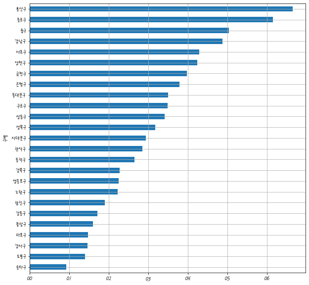
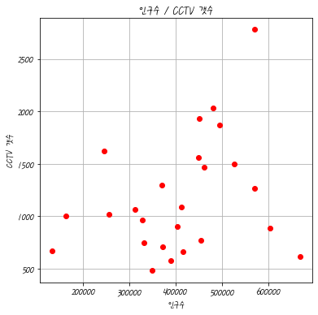

```python
import pandas as pd
import matplotlib.pyplot as plt
import numpy as np 
%matplotlib inline
CCTV_Seoul = pd.read_csv('C:/kcci_python/0506/01.CCTV_in_Seoul.csv',  encoding='utf-8')

#rename 을 이용한 컬럼명 변경  
CCTV_Seoul.rename(columns={CCTV_Seoul.columns[0] : '구별'}, inplace=True)
#CCTV_Seoul.head()

#read_excel() 를 이용한 컬럼 인덱스 이름 지정
pop_Seoul = pd.read_excel('C:/kcci_python/0506/01.population_in_Seoul.xls', 
                          header = 2,
                          usecols = 'B, D, G, J, N',   #불러올 컬럼의 인덱스 번호나 이름을 지정
                          encoding='utf-8')
#pop_Seoul.head()

#컬럼 목록 inplace 
pop_Seoul.rename(columns={pop_Seoul.columns[0] : '구별', 
                          pop_Seoul.columns[1] : '인구수', 
                          pop_Seoul.columns[2] : '한국인', 
                          pop_Seoul.columns[3] : '외국인', 
                          pop_Seoul.columns[4] : '고령자'}, inplace=True)
#pop_Seoul.head()	

#CCTV_Seoul , pop_Seoul     구별 
data_result = pd.merge(CCTV_Seoul, pop_Seoul, on='구별')
data_result.head()   #head(self, n=?)   head(n=?)

#2013년도 이전
#2014년  ~ 2016년
del data_result['2013년도 이전']
del data_result['2014년']
del data_result['2015년']
del data_result['2016년']
data_result.head()

# '구별'을 기준으로 index 선언
data_result.set_index('구별', inplace=True)
data_result.head()

data_result.sort_values(by='소계', ascending=False).head(5)
data_result.sort_values(by='인구수', ascending=False).head(5)


```


<div>
<table border="1" class="dataframe">
  <thead>
    <tr style="text-align: right;">
      <th></th>
      <th>소계</th>
      <th>인구수</th>
      <th>한국인</th>
      <th>외국인</th>
      <th>고령자</th>
    </tr>
    <tr>
      <th>구별</th>
      <th></th>
      <th></th>
      <th></th>
      <th></th>
      <th></th>
    </tr>
  </thead>
  <tbody>
    <tr>
      <th>송파구</th>
      <td>618</td>
      <td>667483.0</td>
      <td>660584.0</td>
      <td>6899.0</td>
      <td>72506.0</td>
    </tr>
    <tr>
      <th>강서구</th>
      <td>884</td>
      <td>603772.0</td>
      <td>597248.0</td>
      <td>6524.0</td>
      <td>72548.0</td>
    </tr>
    <tr>
      <th>강남구</th>
      <td>2780</td>
      <td>570500.0</td>
      <td>565550.0</td>
      <td>4950.0</td>
      <td>63167.0</td>
    </tr>
    <tr>
      <th>노원구</th>
      <td>1265</td>
      <td>569384.0</td>
      <td>565565.0</td>
      <td>3819.0</td>
      <td>71941.0</td>
    </tr>
    <tr>
      <th>관악구</th>
      <td>1496</td>
      <td>525515.0</td>
      <td>507203.0</td>
      <td>18312.0</td>
      <td>68082.0</td>
    </tr>
  </tbody>
</table>
</div>


```python
from matplotlib import font_manager, rc
plt.rcParams['axes.unicode_minus'] = False

if platform.system() == 'Darwin':
    rc('font', family='AppleGothic')
elif platform.system() == 'Windows':
    path = "C:/Windows/Fonts/HMFMPYUN.TTF"
    font_name = font_manager.FontProperties(fname=path).get_name()
    rc('font', family=font_name)
else:
    print('Unknown system... sorry~~~~') 
data_result.head()
```


<div>
<table border="1" class="dataframe">
  <thead>
    <tr style="text-align: right;">
      <th></th>
      <th>소계</th>
      <th>인구수</th>
      <th>한국인</th>
      <th>외국인</th>
      <th>고령자</th>
    </tr>
    <tr>
      <th>구별</th>
      <th></th>
      <th></th>
      <th></th>
      <th></th>
      <th></th>
    </tr>
  </thead>
  <tbody>
    <tr>
      <th>강남구</th>
      <td>2780</td>
      <td>570500.0</td>
      <td>565550.0</td>
      <td>4950.0</td>
      <td>63167.0</td>
    </tr>
    <tr>
      <th>강동구</th>
      <td>773</td>
      <td>453233.0</td>
      <td>449019.0</td>
      <td>4214.0</td>
      <td>54622.0</td>
    </tr>
    <tr>
      <th>강북구</th>
      <td>748</td>
      <td>330192.0</td>
      <td>326686.0</td>
      <td>3506.0</td>
      <td>54813.0</td>
    </tr>
    <tr>
      <th>강서구</th>
      <td>884</td>
      <td>603772.0</td>
      <td>597248.0</td>
      <td>6524.0</td>
      <td>72548.0</td>
    </tr>
    <tr>
      <th>관악구</th>
      <td>1496</td>
      <td>525515.0</td>
      <td>507203.0</td>
      <td>18312.0</td>
      <td>68082.0</td>
    </tr>
  </tbody>
</table>
</div>


```python
plt.figure()
data_result['소계'].sort_values().plot(kind='barh',grid=True,figsize=(10,10))
plt.show()
```


```python
data_result['CCTV비율']=data_result['소계']/data_result['인구수']*100
data_result['CCTV비율'].sort_values().plot(kind='barh',grid=True,figsize=(10,10))
plt.show()
```





```python
plt.figure(figsize=(6,6))
plt.plot(data_result['인구수'],data_result['소계'],'or' )
plt.xlabel('인구수')
plt.ylabel('CCTV 갯수')
plt.title('인구수 / CCTV 갯수')
plt.grid()
plt.show()
```





```python
plt.figure(figsize=(10,10))
plt.scatter(data_result['인구수'],data_result['소계'],s=50 )
plt.xlabel('인구수')
plt.ylabel('CCTV 갯수')
plt.title('인구수 / CCTV 갯수')
plt.grid()
fp1 =np.polyfit(data_result['인구수'], data_result['소계'],1 )
fp1 # 다항식 구성   기울기 , 절편 
f1=np.poly1d(fp1)  # 방정식 구성 
fx = np.linspace(100000,700000,100)
plt.plot(fx,f1(fx),ls='dashed',lw=3,color='g')
plt.show()
```


```python
fp1 =np.polyfit(data_result['인구수'], data_result['소계'],1 )# 다항식 구성   기울기 , 절편 
f1=np.poly1d(fp1)  # 방정식 구성 
fx = np.linspace(100000,700000,100)
data_result['오차']= (data_result['소계']-f1(data_result['인구수']))
df_sort =data_result.sort_values(by='오차',ascending=False)
df_sort

```


<div>
<table border="1" class="dataframe">
  <thead>
    <tr style="text-align: right;">
      <th></th>
      <th>소계</th>
      <th>인구수</th>
      <th>한국인</th>
      <th>외국인</th>
      <th>고령자</th>
      <th>CCTV비율</th>
      <th>오차</th>
    </tr>
    <tr>
      <th>구별</th>
      <th></th>
      <th></th>
      <th></th>
      <th></th>
      <th></th>
      <th></th>
      <th></th>
    </tr>
  </thead>
  <tbody>
    <tr>
      <th>강남구</th>
      <td>2780</td>
      <td>570500.0</td>
      <td>565550.0</td>
      <td>4950.0</td>
      <td>63167.0</td>
      <td>0.487292</td>
      <td>1388.055355</td>
    </tr>
    <tr>
      <th>양천구</th>
      <td>2034</td>
      <td>479978.0</td>
      <td>475949.0</td>
      <td>4029.0</td>
      <td>52975.0</td>
      <td>0.423769</td>
      <td>760.563512</td>
    </tr>
    <tr>
      <th>서초구</th>
      <td>1930</td>
      <td>450310.0</td>
      <td>445994.0</td>
      <td>4316.0</td>
      <td>51733.0</td>
      <td>0.428594</td>
      <td>695.403794</td>
    </tr>
    <tr>
      <th>용산구</th>
      <td>1624</td>
      <td>244203.0</td>
      <td>229456.0</td>
      <td>14747.0</td>
      <td>36231.0</td>
      <td>0.665020</td>
      <td>659.231690</td>
    </tr>
    <tr>
      <th>은평구</th>
      <td>1873</td>
      <td>494388.0</td>
      <td>489943.0</td>
      <td>4445.0</td>
      <td>72334.0</td>
      <td>0.378852</td>
      <td>580.698457</td>
    </tr>
    <tr>
      <th>구로구</th>
      <td>1561</td>
      <td>447874.0</td>
      <td>416487.0</td>
      <td>31387.0</td>
      <td>56833.0</td>
      <td>0.348536</td>
      <td>329.592918</td>
    </tr>
    <tr>
      <th>성북구</th>
      <td>1464</td>
      <td>461260.0</td>
      <td>449773.0</td>
      <td>11487.0</td>
      <td>64692.0</td>
      <td>0.317391</td>
      <td>215.068447</td>
    </tr>
    <tr>
      <th>동대문구</th>
      <td>1294</td>
      <td>369496.0</td>
      <td>354079.0</td>
      <td>15417.0</td>
      <td>54173.0</td>
      <td>0.350207</td>
      <td>165.202586</td>
    </tr>
    <tr>
      <th>관악구</th>
      <td>1496</td>
      <td>525515.0</td>
      <td>507203.0</td>
      <td>18312.0</td>
      <td>68082.0</td>
      <td>0.284673</td>
      <td>162.948104</td>
    </tr>
    <tr>
      <th>종로구</th>
      <td>1002</td>
      <td>162820.0</td>
      <td>153589.0</td>
      <td>9231.0</td>
      <td>25425.0</td>
      <td>0.615404</td>
      <td>143.775396</td>
    </tr>
    <tr>
      <th>금천구</th>
      <td>1015</td>
      <td>255082.0</td>
      <td>236353.0</td>
      <td>18729.0</td>
      <td>32970.0</td>
      <td>0.397911</td>
      <td>35.989293</td>
    </tr>
    <tr>
      <th>성동구</th>
      <td>1062</td>
      <td>311244.0</td>
      <td>303380.0</td>
      <td>7864.0</td>
      <td>39997.0</td>
      <td>0.341211</td>
      <td>9.464016</td>
    </tr>
    <tr>
      <th>동작구</th>
      <td>1091</td>
      <td>412520.0</td>
      <td>400456.0</td>
      <td>12064.0</td>
      <td>56013.0</td>
      <td>0.264472</td>
      <td>-94.122892</td>
    </tr>
    <tr>
      <th>서대문구</th>
      <td>962</td>
      <td>327163.0</td>
      <td>314982.0</td>
      <td>12181.0</td>
      <td>48161.0</td>
      <td>0.294043</td>
      <td>-111.376568</td>
    </tr>
    <tr>
      <th>노원구</th>
      <td>1265</td>
      <td>569384.0</td>
      <td>565565.0</td>
      <td>3819.0</td>
      <td>71941.0</td>
      <td>0.222170</td>
      <td>-125.483618</td>
    </tr>
    <tr>
      <th>중구</th>
      <td>671</td>
      <td>133240.0</td>
      <td>124312.0</td>
      <td>8928.0</td>
      <td>20764.0</td>
      <td>0.503603</td>
      <td>-148.499528</td>
    </tr>
    <tr>
      <th>영등포구</th>
      <td>904</td>
      <td>402985.0</td>
      <td>368072.0</td>
      <td>34913.0</td>
      <td>52413.0</td>
      <td>0.224326</td>
      <td>-268.640012</td>
    </tr>
    <tr>
      <th>강북구</th>
      <td>748</td>
      <td>330192.0</td>
      <td>326686.0</td>
      <td>3506.0</td>
      <td>54813.0</td>
      <td>0.226535</td>
      <td>-329.342026</td>
    </tr>
    <tr>
      <th>광진구</th>
      <td>707</td>
      <td>372164.0</td>
      <td>357211.0</td>
      <td>14953.0</td>
      <td>42214.0</td>
      <td>0.189970</td>
      <td>-425.290264</td>
    </tr>
    <tr>
      <th>강동구</th>
      <td>773</td>
      <td>453233.0</td>
      <td>449019.0</td>
      <td>4214.0</td>
      <td>54622.0</td>
      <td>0.170552</td>
      <td>-465.422892</td>
    </tr>
    <tr>
      <th>중랑구</th>
      <td>660</td>
      <td>414503.0</td>
      <td>409882.0</td>
      <td>4621.0</td>
      <td>56774.0</td>
      <td>0.159227</td>
      <td>-527.718965</td>
    </tr>
    <tr>
      <th>강서구</th>
      <td>884</td>
      <td>603772.0</td>
      <td>597248.0</td>
      <td>6524.0</td>
      <td>72548.0</td>
      <td>0.146413</td>
      <td>-551.503155</td>
    </tr>
    <tr>
      <th>마포구</th>
      <td>574</td>
      <td>389649.0</td>
      <td>378566.0</td>
      <td>11083.0</td>
      <td>48765.0</td>
      <td>0.147312</td>
      <td>-581.180999</td>
    </tr>
    <tr>
      <th>도봉구</th>
      <td>485</td>
      <td>348646.0</td>
      <td>346629.0</td>
      <td>2017.0</td>
      <td>51312.0</td>
      <td>0.139110</td>
      <td>-616.501341</td>
    </tr>
    <tr>
      <th>송파구</th>
      <td>618</td>
      <td>667483.0</td>
      <td>660584.0</td>
      <td>6899.0</td>
      <td>72506.0</td>
      <td>0.092587</td>
      <td>-900.911312</td>
    </tr>
  </tbody>
</table>
</div>


