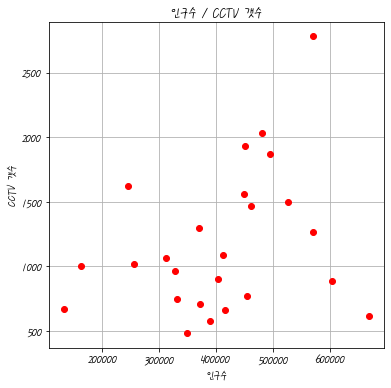
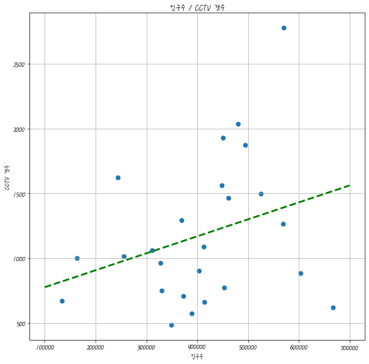

```python
import matplotlib.pyplot as plt
print(matplotlib.__version__)
print(matplotlib.get_backend())

```

    3.1.3
    module://ipykernel.pylab.backend_inline
    


```python
%matplotlib inline
plt.figure()
```


    <Figure size 432x288 with 0 Axes>


    <Figure size 432x288 with 0 Axes>


```python
plt.plot([0,1,2,3,4,5,6,7,8,9,8,7,6,5,4,3,2,1,0])
plt.show
```


    <function matplotlib.pyplot.show(*args, **kw)>


```python
import numpy as np
a=1/100
t= np.arange(0,12,a)
# y=np.cos(t)
plt.figure(figsize=(10,6))
plt.plot(t,np.sin(t),'g',label ='sin')
plt.plot(t,np.cos(t),'r',label ='cos')

# plt.plot(t,y)
plt.grid() # 그리드 적용
plt.legend()
plt.xlabel('time')
plt.ylabel('Amplitude') # x,y 라벨 적용하기
plt.title('test Wave')
plt.ylim(-1.2,1.2) # y 축 축소
plt.xlim(0,np.pi)  # x 축 축소 
plt.show()

```


```python
t= np.arange(0,5,0.5)
# y=np.cos(t)
plt.figure(figsize=(12,6))
plt.plot(t,t,'r--')
plt.plot(t,t**2,'bs')
plt.plot(t,t**3,'g^')

# plt.plot(t,y)
plt.grid() # 그리드 적용
plt.show()

```





```python
t= [0,1,2,3,4,5,6]
y=[1,4,5,8,9,5,3]
plt.figure(figsize=(10,6))
colormap = t
# plt.plot(t,y,'r',marker='o',markerfacecolor='blue')
plt.scatter(t,y,c=colormap,marker='o')
plt.show()
```





```python
# loc 평균 , scale 표준편차 , size =x 축 
s1 = np.random.normal(loc = 0 , scale =1 , size = 1000)
s2 = np.random.normal(loc = 5 , scale = 0.5 , size = 1000)
s3 = np.random.normal(loc = 10 ,scale = 2 , size =1000)
plt.figure(figsize=(10,6))
plt.plot(s1,label='s1')
plt.plot(s2,label='s2')
plt.plot(s3,label='s3')
plt.legend()
plt.show()
```


```python
t=np.arange(0,5,0.01)
plt.figure(figsize=(10,12))
plt.subplot(411)
plt.plot(t,np.sqrt(t))
plt.subplot(423)
plt.plot(t,t**2)
plt.subplot(424)
plt.plot(t,t**3)
plt.subplot(413)
plt.plot(t,np.sin(t))
plt.subplot(414)
plt.plot(t,np.cos(t))

plt.show()
```


