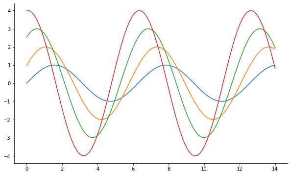
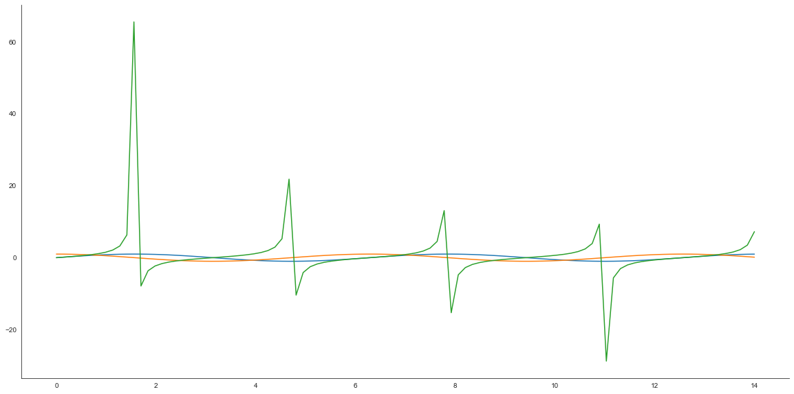

```python
import numpy as np
import seaborn as sns
import matplotlib.pyplot as plt
%matplotlib inline 

x= np.linspace(0,14 ,100)
y1 =np.sin(x)
y2=2*np.sin(x+0.5)
y3=3*np.sin(x+1.0)
y4=4*np.sin(x+1.5)

plt.figure(figsize =(10,6))
plt.plot(x,y1,x,y2,x,y3,x,y4)
sns.despine()
plt.show()
```





```python
x= np.linspace(0,14 ,100)
y1 =np.sin(x)
y2=np.cos(x)
y3=np.tan(x)


plt.figure(figsize =(20,10))
plt.plot(x,y1,x,y2,x,y3)
sns.set_style("white")
sns.despine()
plt.show()
```





```python

```
